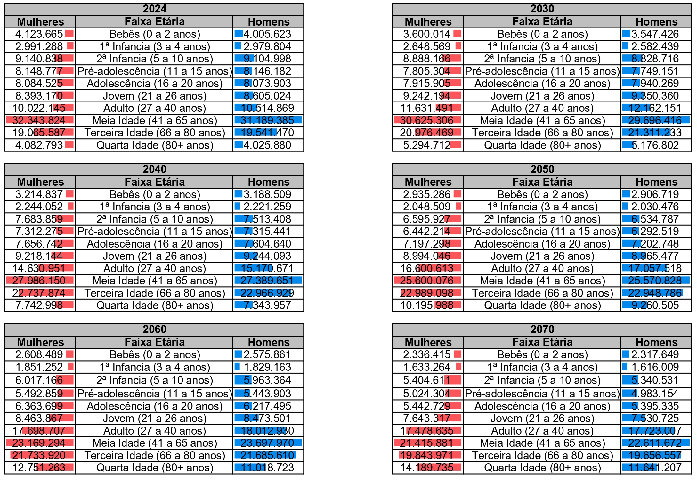
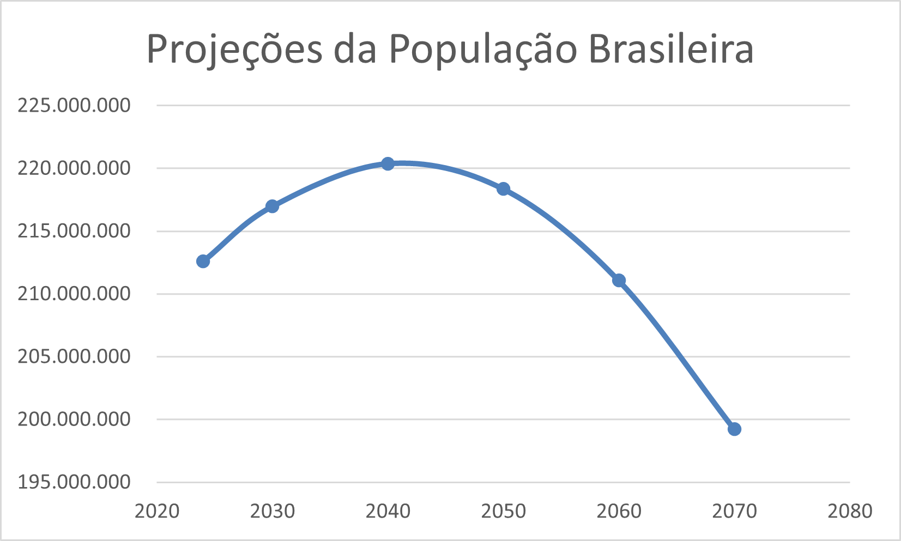

# Evidências Visuais - Operações OLAP

## 📊 População Total por Faixa Etária (2024-2070)

## 📈 Evolução da População Brasileira (2024 a 2070)

> Os gráficos foram gerados com base nas projeções populacionais segmentadas por faixa etária e gênero, disponíveis no diretório `/data`.
