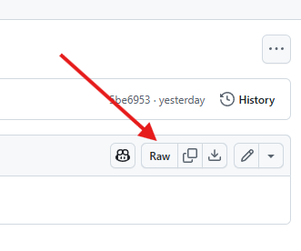

# Evidências Visuais - Operações OLAP

## 🎥 Vídeo de Apresentação
📽️ [Clique para Baixar: Vídeo de Apresentação do Banco de Dados](video/video_apresentacao_banco_dados.mp4)

Para salvar o video clique no link acima e no botão RAW

## 📊 População Total por Faixa Etária (2024 a 2070)

## 📈 Evolução da População Brasileira (2024 a 2070)

## 📈 Evolução da População Brasileira por Faixas Etárias (2024 a 2070)

> Os gráficos foram gerados com base nas projeções populacionais segmentadas por faixa etária e gênero, disponíveis no diretório `/data`.

## 🖼️ Galeria de Imagens do Banco de Dados em Funcionamento
📂 [Acessar pasta com imagens do banco de dados](ImagensBanco)
